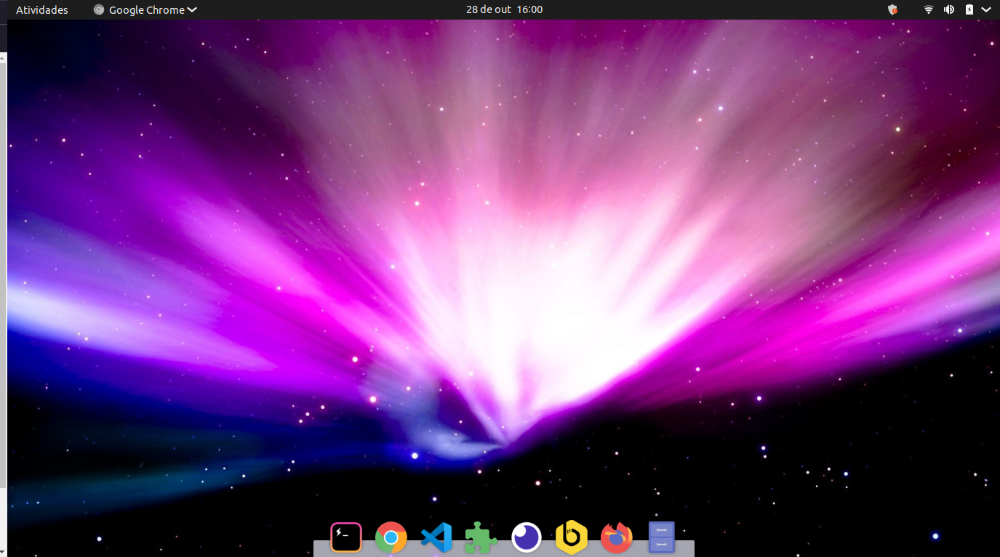

# Minhas configurações

- Configuração do Hyper 👉 
- Configuração do terminal SpaceShip 👉 
- Arquivo que utilizo para instalar os programas que mais utilizo 👉 
- Arquivo para atualizar repositórios e instalar qualquer programa automaticamente 👉 

## Utilização

Para utilizar o arquivo de instalação dos programas ou atualizador de pacotes basta abrir o terminal e verificar o shell:
```shell
echo $SHELL
```
No meu caso é o zsh, então na pasta onde se encontra os arquivos, basta rodar o comando no modo sudo:
```shell
zsh ./instalador.sh
zsh ./light.sh
```

## Meu amgiente GTK



Passo a passo de como configurar o ubuntu do zero 👉 [Passo a passo no notion](https://www.notion.so/viviramos/Personalizando-meu-Linux-ca87bd6244fe4e6aa3b8a0caeea17bd6)
